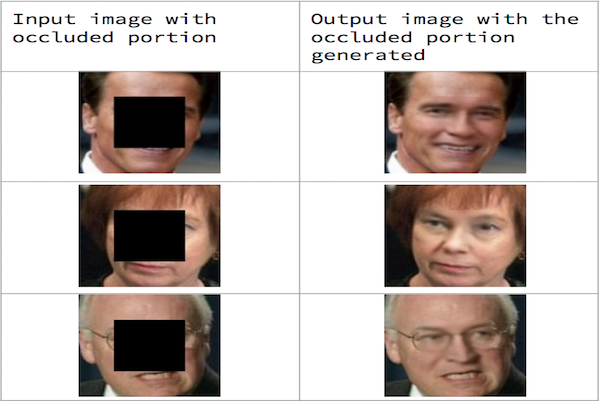

# Image Inpainting using Context Encoders

In this project, I have trained a Deep Convolutional Network to generate missing portions of an input image. The method used is inspired by [Context Encoders: Feature Learning by Inpainting](https://arxiv.org/abs/1604.07379). A potential application of this project is the digital restoration of damaged images.

### Prerequisites

In order to clone and reproduce results from this repository, you will need to install:
* Python 2.7
* Numpy
* Tensorflow
* OpenCV

## Contributing

Feel free to clone and add extensions. Pull Requests are welcome.

## Authors

* **Vijay Veerabadran** - [Vijay V](https://vijayvee.github.io)

## Acknowledgments

* [Context Encoders: Feature Learning by Inpainting](https://arxiv.org/abs/1604.07379)

## Output samples:
 
